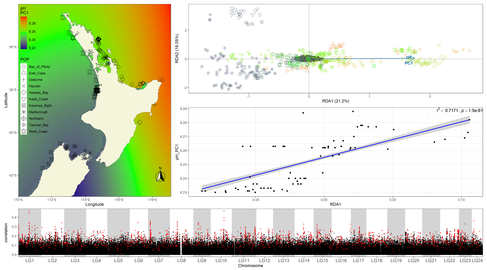

# EMC_job_application
Source code Tom Oosting

Contents
1. Sbatch array script for genotyping by chromosome using BCFtools and estimateing summary statistics for a genome scan
2. Rmarkdown script containing source code for performing and visualising a genome scan (different package than the one above but same approach)
3. Rmarkdown script containing source code for visualising the results from an RDA analyses.

### 1. SBATCH array
The following script uses bam files and a file with sample and populaiton information to generate AllSites VCF per linkage group.
Resulting VCF files are tab indexed an run in [pixy](https://pixy.readthedocs.io/en/latest/index.html).
Output from pixy is used in R to identify selection in the genome.
```
#!/bin/bash
#SBATCH -a 1-24
#SBATCH --cpus-per-task=8
#SBATCH --mem-per-cpu=10G
#SBATCH --partition=parallel
#SBATCH --time=5-0:00
#SBATCH --job-name=pixy
#SBATCH -o /nfs/scratch/oostinto/stdout/pixy_%A_%a.out
#SBATCH -e /nfs/scratch/oostinto/stdout/pixy_%A_%a.err
#SBATCH --mail-type=END,FAIL
#SBATCH --mail-user=tom.oosting@vuw.ac.nz

#activate conda environment for pixy
source activate pixy  

#load modules
module load htslib/1.9
module load bcftools/1.10.1

###input parameters
PROJECT=$1
SET=$PROJECT'_'$2
LG=${SLURM_ARRAY_TASK_ID}

###paths to input files
POP=$SCRATCH/projects/$PROJECT/resources/sample_info/$SET'_pixy.tsv'
BAM=$SCRATCH/projects/$PROJECT/resources/bam_lists/$SET'_bam.list'
REF=$SCRATCH/projects/$PROJECT/resources/reference_genomes/nuclear/Chrysophrys_auratus.v.1.0.all.assembly.units.fasta

###set paths
OUT=$SCRATCH/projects/$PROJECT/output/$SET/pixy
TMP=$OUT/tmp
mkdir -p $TMP

###obtain name linkage group
REG=$( head -n $LG $REF.fai | tail -n 1 | cut -f 1 )

#genotype and filter
echo "performing genotyping and filtering"
bcftools mpileup    -f $REF                           \
                    -b $BAM                           \
                    -r $REG                           \
                    -a 'INFO/AD,FORMAT/AD,FORMAT/DP'  |
bcftools call       -m                                \
                    -Ou                               \
                    -f GQ                             |	 
bcftools +fill-tags -Ou                               \
                    -- -t AC,AF,AN,MAF,NS             |
bcftools filter     -Ou                               \
                    -S .                              \
                    --exclude 'FMT/DP<3 | FMT/GQ<20'  |
bcftools view       -Oz                               \
                    -M2                               \
                    --exclude 'STRLEN(REF)!=1 | STRLEN(ALT) >=2 | QUAL<600 | AVG(FMT/DP)<8 | AVG(FMT/DP) >25' \
                    -o $TMP/$REG'_'$SET'.allsites.vcf.gz'

#create index
echo "creating index"
tabix -f $TMP/$REG'_'$SET'.allsites.vcf.gz'

#run pixy
echo "running pixy"
pixy --stats pi dxy fst                           \
     --vcf $TMP/$REG'_'$SET'.allsites.vcf.gz'     \
     --populations $POP                           \
     --window_size 5000                           \
     --n_cores 4                                  \
     --output_folder $OUT                         \
     --output_prefix $REG'_'$SET

#clean up
#rm -r $TMP	#only run this if you're sure you no longer need the AllSites VCF files, they are large!
```
### 2. genome scan (genome_scan.Rmd) 
This Rmarkdown script utilises a different package to perform a genome scan (i.e. [PopGenome](https://popgenome.weebly.com/)).
The script also imports the associated functions.R file containing fuctions I've created.
These include functions for importing/generating gds files, extracting SNP information and range of other functions I use in this or other analyses.
input for this analyses is:
1. gds file (SNPRelate version of a VCF which loads instantly even if containing millions of SNPS)
2. sample file contianing sample IDs (IND), and population IDs (GENETIC_CLUSTER)
3. Reference genome index .fai file to extract linkage group names and lenghts
4. Indexed vcf.gz files for each linkage group

The script performs a sliding window analyses, estimating summary statistics like nucleotide diversity, Tajima's D, dxy, and FST. Results are visualised using Manhattan plots. For plotting, cumulative positions (BPcum) have been obtained so esimates from seperate chromosomes can be plotting along the same axis. The X-axis shows the position on the genome with chromosomes/linkage groups indicated, and for each seperate panel the Y-axis shows the estimate for a specific summary statistic. Here I used FST > 0.15 (a measure for relative population divergence) to identify which genomic regions may be under selection. the other summary statistics provide information which evolutionary processes may driven selection.


### 3. Visialisation RDA analyses
!!!lines 160-215 have been adopted from a turorial!!!
The input for this analyses is more extensive. Similar to the genome scans, the scripts load:
1. gds file with genotype information
2. sample information including sample names, sample locations, GPS coordinates

The rest is the output from the RDA analyses which was done in a different script, including:
1. environmental parameters associated with the sample location of each individual (pH, temperature, etc..)
2. imputed SNP matrix
3. RDA output
4. data from Bio-ORACLE for plotting environmental parameters on spatial maps

The script generates a "main" RDA plot and then produces multiple panel plots that visualises the relation between genomic diversity and environmetnal parameters. 
**main plot**
The ordination plot shows how genetic variation present within each individual is correlated with envrinmental parameters, vectors show the direction in which the correlation between genetic variation and that specific factor is strongest.  

**panal plots**
The last section of the script loops over each environmental factor and generates a panel for each. the maps show how the environmetnal gradients and the location of each sample. The ordination plot is similar to the main plot but only shows the vector for a specific envrionmental factor. Samples are colored based on the value of the environmental parameter at the given sample location. the regression plot shows relationship with the first axis of the RDA and environmental parameters for each sample. And finally, the Manhattan plot shows  whichs SNPs are signicantly correlated with the first axis of the RDA, with the y-axis showing the correlation (r2) allele frequencues of that SNP in the population and that specific environmental factor.



